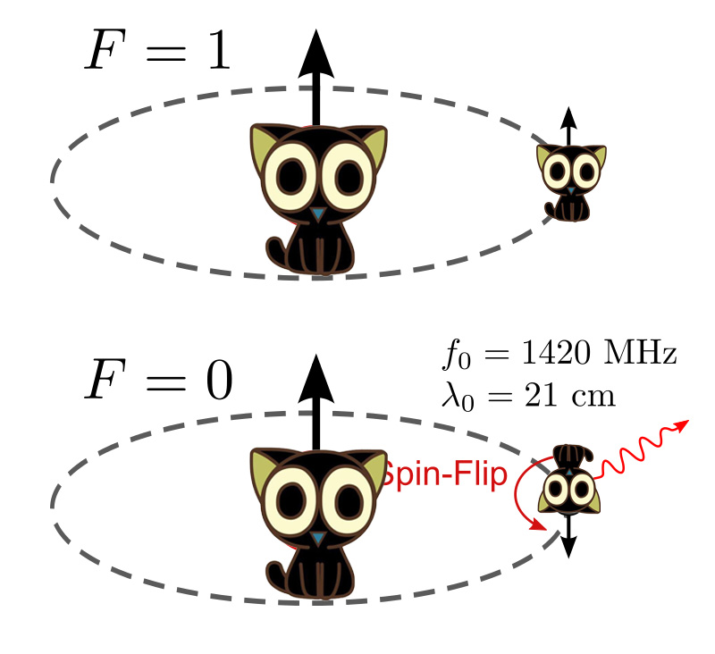
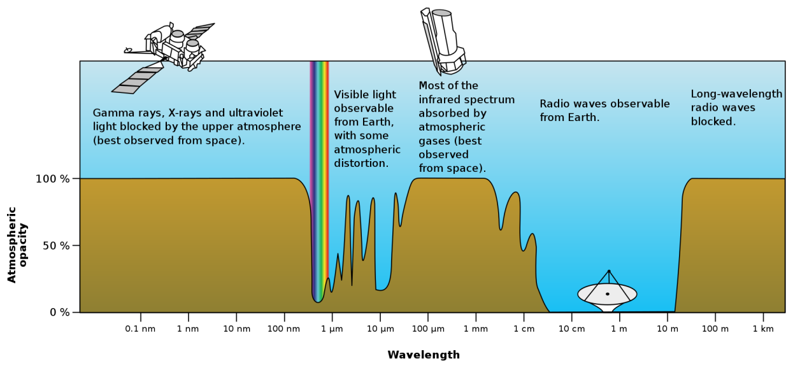
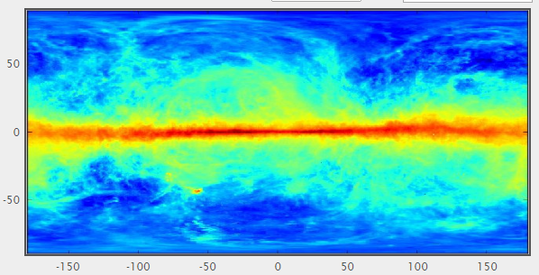

- 天然氢原子由一个质子和一个环绕质子的电子组成。除了轨道运动以外，质子和电子都有自旋。经典的看法将氢原子看作月球绕地球公转，同时月球和地球又分别自转。质子和电子的自旋为平行的氢原子（F=1）其能量比自旋是反平行的氢原子（F=0）高，当氢原子的状态由F=1变为F=0时（即跃迁），会放出频率为1420MHz、波长为21cm的电磁波。
-
- {:height 497, :width 514}
  _**图1.质子和电子的自旋为平行的氢原子，其能量比自旋是反平行的氢原子高**_
-
- 这个跃迁的概率极小（一个氢原子1000万年才会发生一次），几乎不可能发生，所以这条21cm电磁波谱线也被称为21cm禁戒线。但是正因为这样，这条21cm谱线很少受环境因素的干扰，成为了我们重要的研究目标。虽然几乎不可能发生，但是星际空间中有大量中性氢原子，所以这种谱线可以被我们观测到，可以 [[利用氢谱线绘制银河系的原理]]
-
- 
  _**图2.地球大气窗口**_
-
- 在图2中，横轴是电磁波波长，纵轴是大气对相应波长的不透明度，可知大气对15MHz（波长20m）到1300GHz（波长0.3mm）是透明的，这被称为地球大气的射电窗口。由图知大气对可见光波段也是透明的，即地球大气的“可见光窗口”。
-
- 大气显然对21cm氢谱线是透明的，故我们可以在地面上通过大气射电窗口对宇宙中的21cm氢谱线进行观测，如同通过大气光学窗口对宇宙中的可见光进行观测一般。
-
- {:height 313, :width 598}
  _**图3.21cm氢谱线全天扫描图**_
-
- 图中横坐标为银经，纵坐标为银纬，类似于地球的经度和纬度。颜色表示强度，越红表示强度越强，越蓝表示强度越弱，而中间那一条红色的带子就是银河银盘的21cm氢谱线扫描图。想象地面是透明的，你拿着光学望远镜扫描全天（360度无死角），并把通过光学望远镜所拍摄的所有星空图片拼接在一起，可以知道这些图片可以组成一个如同地球的球形，是对全天星空的重现。如果你站在由这些图片组成的球形中央，你就如同看到了真的全天星空一样。
-
- 地球是球形，然而你看到的地图却是矩形或者椭圆形。矩形是利用了墨卡托投影，参考[一个小游戏让你彻底弄懂墨卡托投影](https://zhuanlan.zhihu.com/p/33295151)；椭圆形利用了等差分纬度线多圆锥投影，参考百度。所以你可以把刚才用光学望远镜得到的球形星空图展开为矩形星空图，如同上图那个21cm氢谱线的扫描图。
-
- 正如你拿着光学望远镜扫描全天一样，你可以拿着射电望远镜在21cm氢谱线所在波段扫描全天，得到21cm氢谱线全天扫描图。本来应该是球形的，但可以利用墨卡托投影展开为矩形，如同上图。
-
- 参考了一些资料，基本上都是网上的，在此就不一一列出了