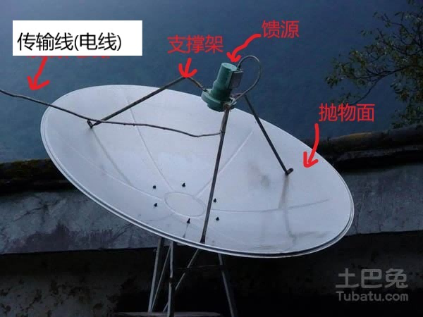
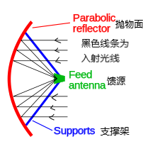
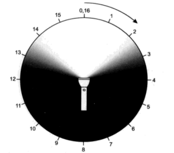
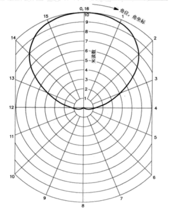
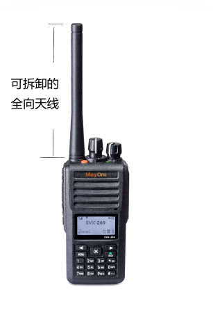
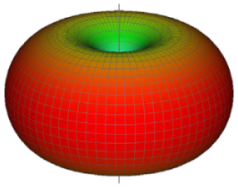
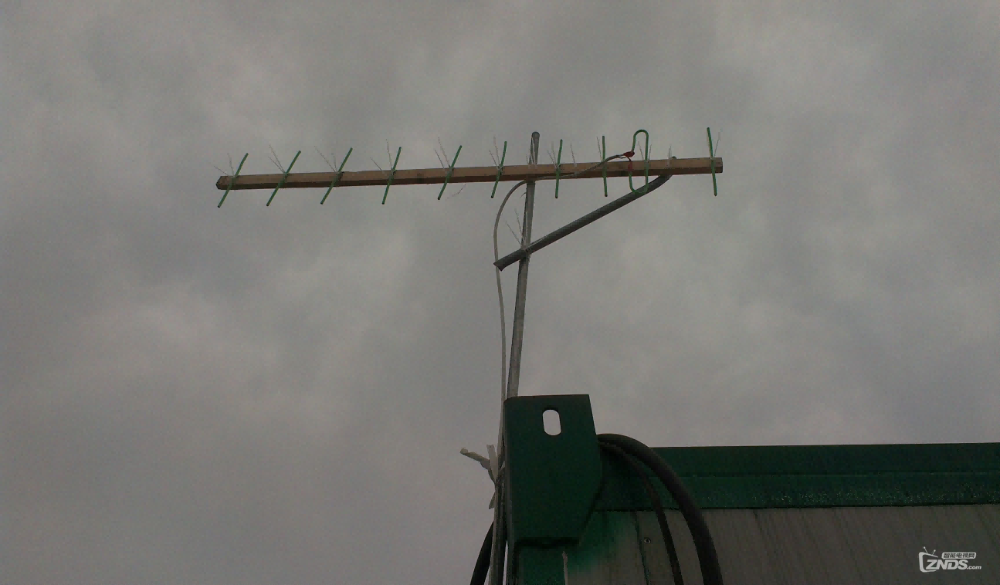
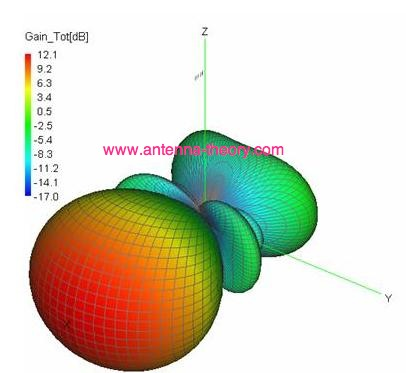
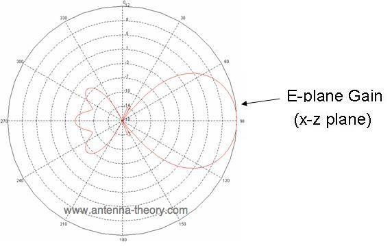
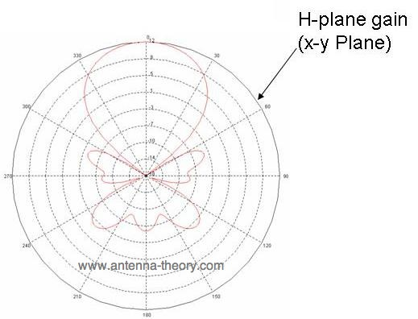

alias:: 天线

- ## 天线介绍视频和文章推荐
	- 见于[[天线的介绍视频和文章]]
- ## 天线的概念
	- 天线位于 [[射电望远镜链路]] 的开端，具有很重要的地位
	-
	- **[天线(antenna)](https://baike.baidu.com/item/%E5%A4%A9%E7%BA%BF/790545)** ：一种能接收和发射电磁波的东西，例如可以用它来[[接收国际空间站过境]]
	-
	- **[电磁波(electromagnetic wave)](https://baike.baidu.com/item/%E7%94%B5%E7%A3%81%E6%B3%A2)** ：肉眼能看到的 **[可见光(visible light)](https://baike.baidu.com/item/%E5%8F%AF%E8%A7%81%E5%85%89)** 在本质上就是一种电磁波，我们也可以把电磁波称为**光(light)**，所以我们**把电磁波类比于可见光**。
	  
	   
	  _图1.1 接收电视信号所用的[电视锅](https://baike.baidu.com/item/%E5%8D%AB%E6%98%9F%E9%94%85/5508183)，其表面是抛物面，可以把平行入射的电磁波全部反射到一点（抛物面的焦点），光路图见图1.2。所以通常在焦点处放置一个收集电磁波的**馈源(feed)**，馈源上接有**传输线(transmission line)**，传输线会把接收到的信号传送到**接收机(receiver)**_
	  
	    
	  *图1.2抛物面光路图*
- ## 天线的方向性
	- 以下内容参考于《天线手册》/英文名：The ARRL ANTENNA BOOK
	-
	- 天线既可以接收电磁波，也可以发射电磁波。我们可以把天线当作一个手电筒，把手电筒发射出的可见光当作天线发射出的电磁波。
	-
	-  
	  *图1 电筒照亮整个黑暗区域的光束情况。读数来自照相用的光度计沿着圆圈取16个点值，用于表示出电筒的照射图形。*
	-
	- 图1显示了一个在完全黑暗的房间里的一束电筒的光。为了量化我们的眼睛所看到的东西，我们使用摄影师所用的光强计来测量，并把其亮度分为0到10级。我们把光强计放在电筒的正前方，并调节光强计与电筒的距离，使光强计读数为10，即满量程。我们还要认真地记下光强计与电筒的距离。然后保持光强计与电筒的这个距离以及光强计离地面的高度，把光强计按箭头所示方向绕电筒移动，在若干个不同的位置记下光强计的读数。
	-
	- 记下所有读数后，我们把这些读数记在极坐标纸上，如图2所示。完成后，我们就画出电筒光的方向图样了。
	-  
	  *图2 在图1电筒的照射图形。这些测量值使用平滑曲线连接起来画出，平滑曲线上某点到原点的距离即为该方向上光的强度。图中的同心圆表示光强计的读数(刻度)，'米读数'英文原文为meter reading，应该翻译为'仪器读数'即光强计的读数*
	-
	- 天线的方向图也可以用类似的方法进行测量。对待测量天线加上一定的功率，用场强仪测量天线在每个方向上发射信号的强度，从而得到天线的接收方向图。由天线的**互易原理**(reciprocity theorem，没有必要深究) 可知，天线的接收方向图和发射方向图是一样的。
	-
	- 所谓的接收方向图，就是指天线对不同方向的灵敏度不一样。同一个信号，如果从天线灵敏度高的方向入射到天线，则我们在与天线相连的接收机上看到较强的读数，如果从天线灵敏度较高的方向入射到天线，则我们在接收机上会看到较弱的读数，甚至是零。而正如上文所说的那样，天线的接收方向图和发射方向图是一致的。
	-
	- 下面一节会提供一些实例，给读者以直观的感受
- ## 天线方向图实例
	- 之前我们都是在二维平面上讨论天线的方向图，而实际天线的方向图都是三维的。
	-
	- ### 全向天线(omnidirectional antenna)
	  
	   
	  *图1.1 对讲机上的全向天线，可以拆卸下来，然后在接口上给对讲机连接上新的天线*
	  *图片来源于[链接](https://www.motorolasolutions.com/zh_cn/products/two-way-radios-business/portable-radios/commercial-series/evx-z69.html#tabproductinfo)*
	-
	-  
	  *图1.2全向天线的方向图，就如同一个甜甜圈一样。容易看出在接收电磁波时，全向天线对上下方的信号非常不敏感，而对垂直于天线入射的电磁波敏感。*
	  *图片来源于[链接](https://www.wilsonproway.com/blog/directional-or-omnidirectional-which-antenna-is-best/)*
	-
	- ### 八木天线(yagi antenna)
	  {:height 355, :width 592} 
	  *图2.1接收电视信号所用的八木天线*
	-  
	  *图2.2 八木天线的三维方向图*
	-  
	  *图2.3 八木天线三维方向图中xz轴的横截面*
	-  
	  *图2.3 八木天线三维方向图中xy轴的横截面*