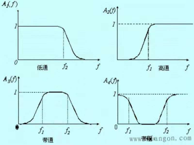

alias:: 射电望远镜链路

- 下面以小型射电望远镜为例，做一个极为简单的描述，忽略了很多细节
  部分，仅是为了让读者熟悉大概的链路。
- 
- **_图1：小型射电望远镜链路图，其中放大器和滤波器可以集成为放大滤波模块_**
-
- ## [[天线]]
	- 一种能收发电磁波的物体，一般为金属。来自天体的电磁波使得金属中的自由电子振动，从而产电流信号。
	  id:: 620ddae1-5c9b-402a-be92-e3820feb9b8f
	-
- ## 低噪放大器和滤波器
	- 两者都是为了尽可能让所测信号在底噪中突出显示，即提高信噪比；放大滤波模
	  块的实物图如下
	- 
	  **_图2.放大滤波器_**
	-
	- 低噪放大器在引入尽可能少噪声的情况下，对信号进行放大；
	- 
	  **_图3.低噪放大器的作用_**
	-
	- 滤波器可以过滤掉非观测频率的电磁信号
	- 
	  **_图4.滤波器的作用_**
	-
- ## 接收机和处理软件
	- 接收机可以使连续的模拟信号转变为离散的数字信号，同时接收机也
	  具有其他方式的信号处理功能。
	- 
	  **_图5.airspy接收机_**
	- 
	  **_图6.接收机模数转化的作用_**
	-
	- 处理软件可以对输入信号进行傅里叶变换，显示出频谱，也有其他一些作用。
	- {:height 482, :width 592}
	  **_图7.软件 sdrsharp 显示出频谱_**
-