- ## 得知空间站发射信号日期
	- 如果你是一名业余无线电爱好者，那么通过听周围或者群里的人对话，你便能及时得知空间站发射SSTV信号的消息。
	- 如果不是的话，你可以关注一些公众号，比如“业余无线电”，它会推送相关的消息，公众号截图如下。空间站大概两个月左右举办一次SSTV信号发射活动吧，具体间隔我也没太关注过，如果有兴趣地话可以在网上收集一些相关资料。
	- {:height 1286, :width 590}
	- 然而如果你英语较好而且可以连上外网，那么可以尝试从官方网站
	  https://www.ariss.org/ 来读取通知。
	- [这篇文章](http://mp.weixin.qq.com/s?\_\_biz=MzI3MDk4NDAwNA==&mid=2247488116&idx=1&sn=6964e1399a5d200e72fd6763efe17d3e&chksm=eac9e45fddbe6d491a8610b864853b1157a3ce2a902764b9b643c4a33ea585109b231f12e8e9&mpshare=1&scene=23&srcid=1004KzuFRtnEesdeUt5I1aeb&sharer\_sharetime=1602169464377&sharer\_shareid=7b2e9d923806478e26f007612c7b0b77#rd)的末尾附有一些比较官方的外网相关链接，有兴趣的读者可以点开看一看。
- ## 展示具体过程的视频
	- {{bilibili https://www.bilibili.com/video/BV13b411j7Y5?p=1&share_medium=android&share_plat=android&share_source=QQ&share_tag=s_i&timestamp=1600595624&unique_k=B2l4uP}}
- ## 慢电视扫描
	- {{embed [[慢电视扫描(SSTV)]]}}
- ## 以前活动的照片
	- 之前天文协会和无线电协会在冬天一起去南核心教学区楼顶尝试过，活动图片如下，其中有一部分是无线电社的同学拍摄的。
	- 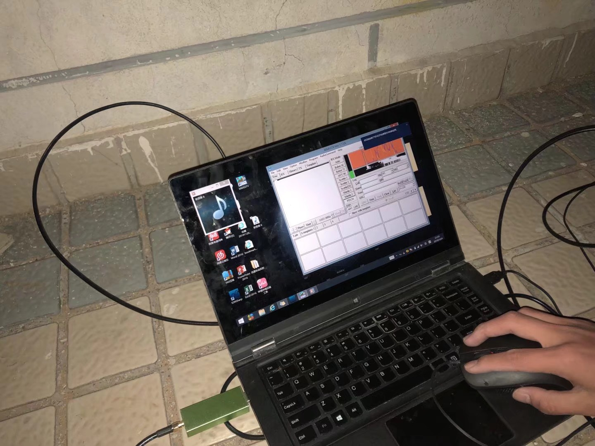{:height 473, :width 620}
	  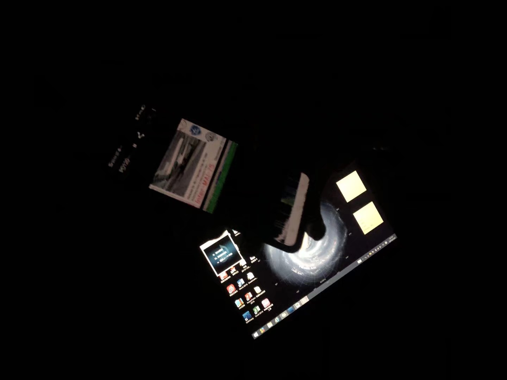{:height 473, :width 620}
	  {:height 473, :width 620}
	  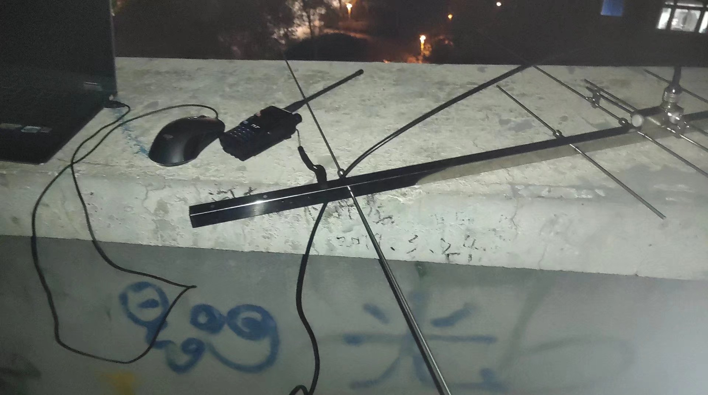{:height 473, :width 620}
	  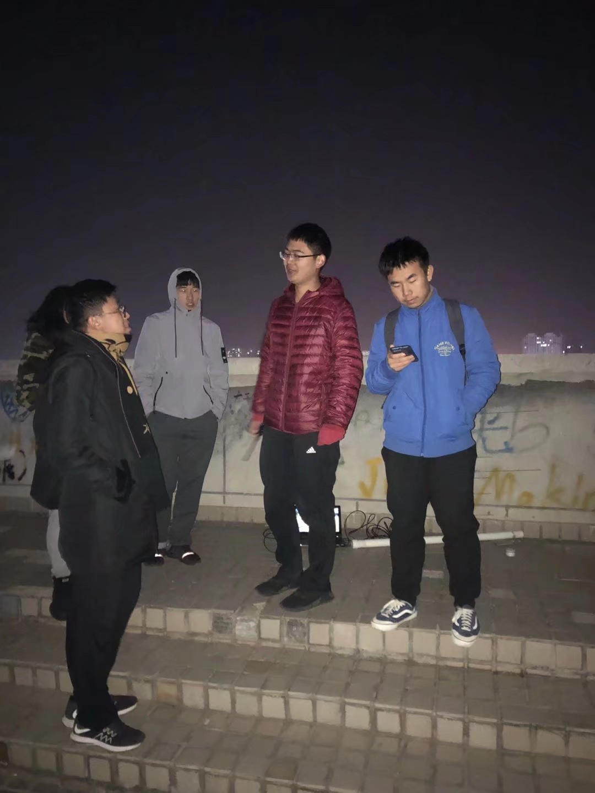{:height 835, :width 620}
- ## 可以使用的软件及说明
	- ### iss detector使用说明
	  安装好后，第一次进去的时候可能要开定位  
	  如果进去后一直自动刷新，但刷新不出来东西的话，可以退出重进。如果还是不行，就多次退出重进几次。
	  如果空间站的比较亮(星等越小越好，最好小于0)且仰角比较高，在晴朗的夜晚下则可以肉眼看到国际空间站（一个亮点）以较快的速度在天空移动。
	  下图中，红圈中是过滤器，可以把白天过境的国际空间站给过滤掉，也可以过滤掉低角度过境的国际空间站
	  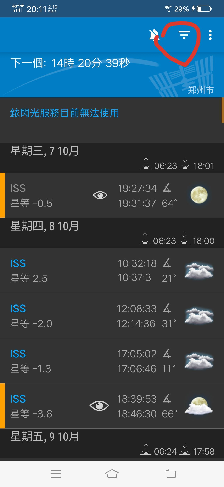{:height 701, :width 320} 
	  但如果不想过滤掉白天过境的国际空间站，则操作如下：
	  点击红笔圈着的箭头，从而显示出下拉列表
	  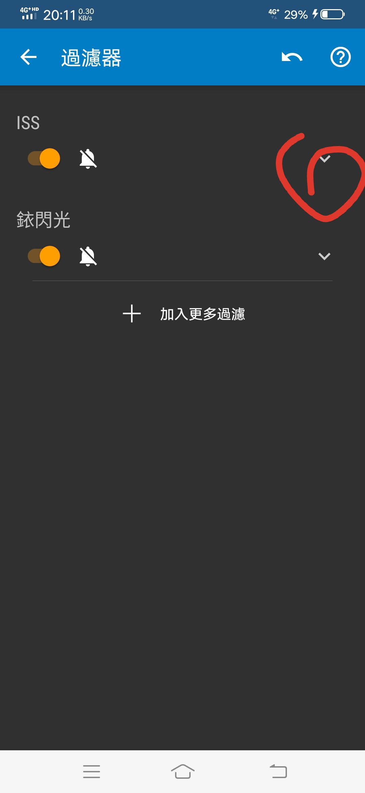{:height 700, :width 320}
	  在下拉列表中选择红圈中的“关闭”之后，就会显示出所有时间段的空间站过境了
	  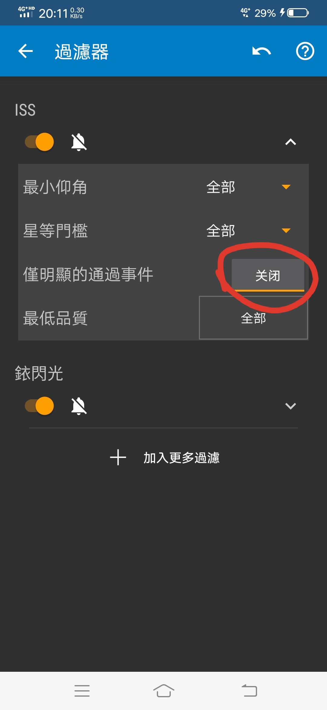{:height 700, :width 320}
	- ### robot36使用说明
	  首先进入软件，然后在后台播放接收到的音频信号
	  之后再切换回软件，会发现软件渐渐将后台播放的音频解码成图片。
	  待图片的解码完成后(必须等到图片完全不更新后，否则图中可以耐心等一会)，点击下图红圈中的分享，可以分享到QQ等软件中；点击下图篮圈中的保存，可以手机相册中找到(应该在某个子相册中)。
	  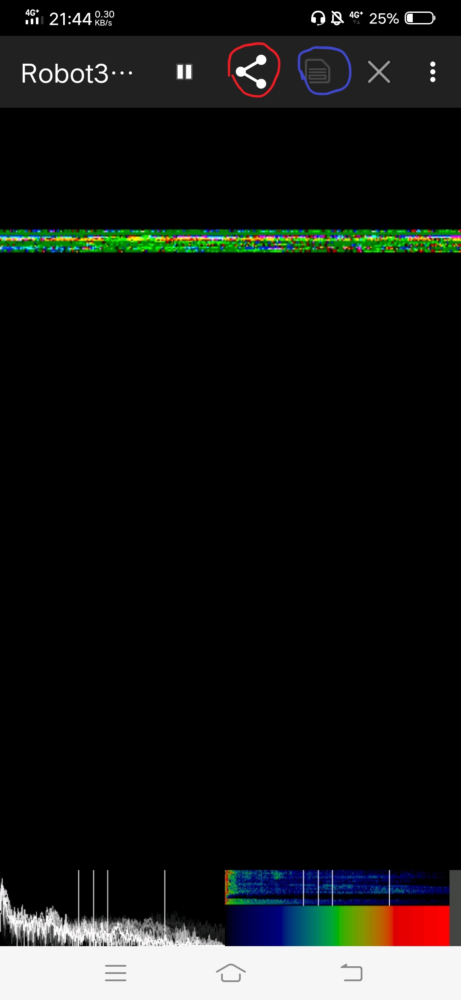{:height 700, :width 320}
- ## 可参考的视频
	- {{bilibili https://www.bilibili.com/video/BV1cT4y1L7nA}}
	- {{bilibili https://www.bilibili.com/video/BV14b411m7DJ}}
	- {{bilibili https://www.bilibili.com/video/BV1Wt41117Z1}}
	-
- ## 2020年10月接受到的部分照片
	- 20201008_184506（即：2020年10月8日，18点45分06秒）
	  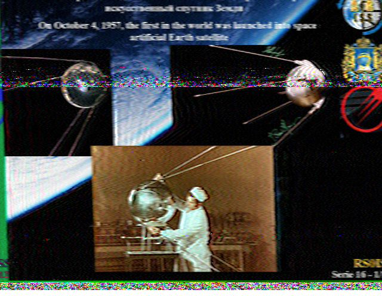{:height 467, :width 590}
	- 20201008_121249
	  
	- 20201008_120859
	  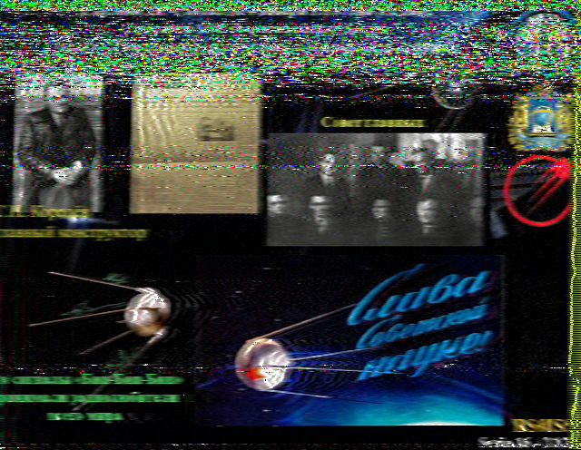{:height 467, :width 592}
	- 20201008_103601
	  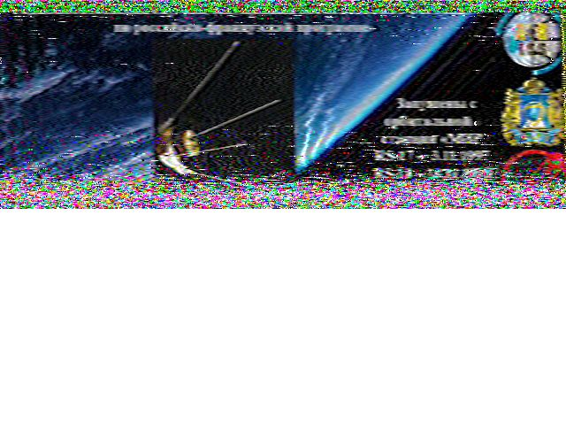
	- 20201008_103241
	  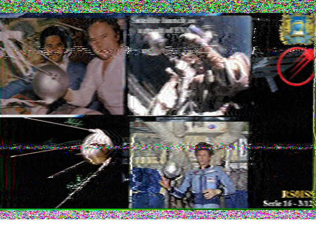
	- 20201007_192734
	  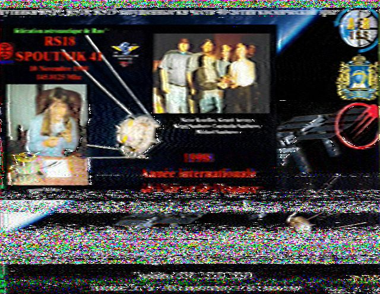
	- 20201007_130015
	  
	- 20201007_130015
	  {:height 490, :width 622}