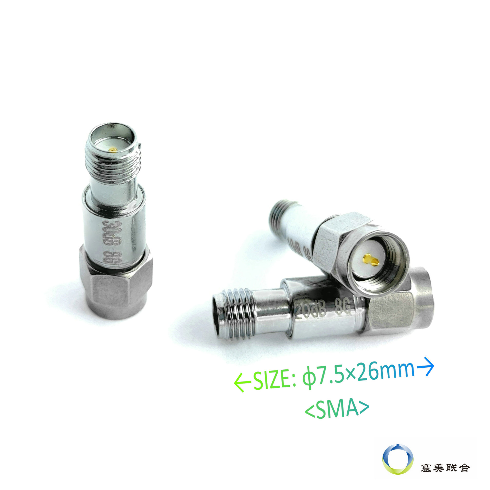
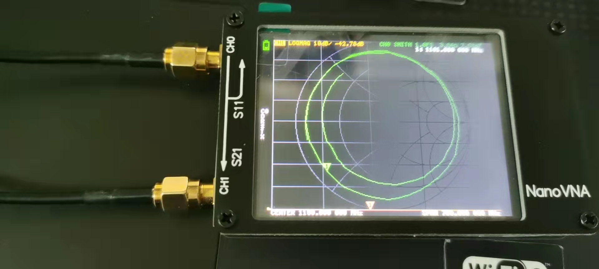
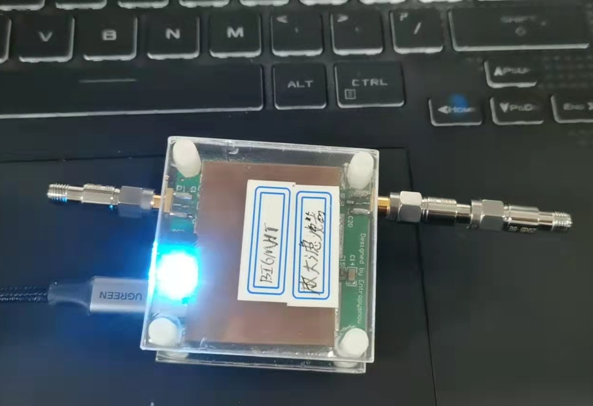
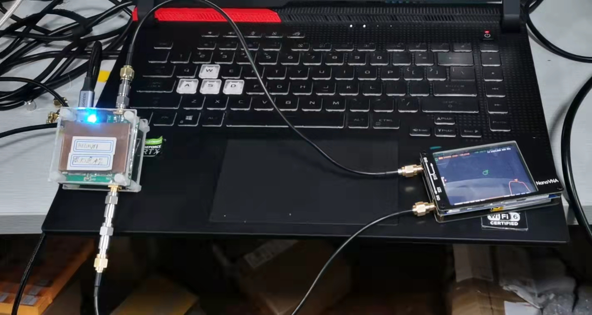

- {{bilibili https://www.bilibili.com/video/BV1rF411b7Lv?share_source=copy_web}}
- 如果你完全不了解NanoVNA（一种矢量网格分析仪），可以在B站搜索NanoVNA，你会得到一系列的教程，如图1所示。
- 
  图1.B站上关于NanoVNA的介绍
-
- 介绍测量放大器之前，我先介绍一下S21参数，S即Scatter的缩写，2即代表第二的端口，可以理解为输出端，1即代表第一个端口，可以理解为输入端。S21=输出端的功率/输入端的功率，得到输入功率被放大的倍数，然后带入10log(倍数)。我们测放大器就是测S21参数，即放大器的放大倍数或者说增益。
-
- 首先注意不要直接把高增益的放大器直接连通到NanoVNA上，这将会对NanoVNA造成损害。所以在测量时需要连接上几个衰减器，如图2，淘宝上搜索衰减器能够搜索到。我花费66块钱(含20块钱运费)在淘宝上买了两个20dB和一个30dB的衰减器。
-
- {:height 784, :width 776}
  图2.淘宝上买的衰减器
-
- 使用起来也非常方便：
- 首先肯定要先完成NanoVNA的定标。然后依次点击Display>Channel>CH1 Though；Display>Format>Logmag，显示出S21曲线；Display>Scale>Scale/Div,输入10，即每一格代表10dB；Display>Scale>Reference，输入4，大概是以第4格线为基准线，即0dB。图3中黄色的是S21曲线，可能太低了，看不到，不过没关系。
-
- 
  图3.底下看不到的黄色曲线是S21曲线
-
- 在放大器的输入端和输出端分别接上衰减器，比如说我要测的放大器的增益的增益在1420MHz附近大概是是48多dB，我可以在输入端接20dB的衰减器，在输出端接30dB、20dB的衰减器，总共的衰减是70dB，如图4所示。
- 
  图4.放大器两端接衰减器
- 在连接放大器到NanoVNA之前可以先给放大器通上电预热一会，然后再接到NanoVNA上，如下图5所示
- 
  图5.连接图
- 最后测得如下图，可以看到是-20dB左右，-20dB+70dB，即得到50dB，接近真实的值了。
- 
  图6.最终的测试结果