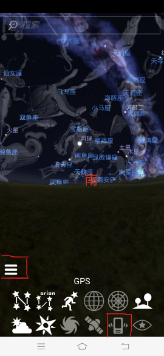
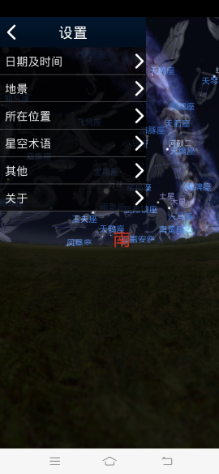

- ## 视频
	- {{bilibili https://www.bilibili.com/video/BV1dQ4y1U7Di?spm_id_from=333.999.0.0}}
- ## 介绍
	- **[虚拟天文台/馆(stellarium)](http://stellarium.org/zh_CN/)** 是一款开源的天象模拟软件。它以3D形式展示了极为逼真的星空，就像你在真实世界使用裸眼，双筒望远镜或天文望远镜看到的一样。
	  该软件在安卓、苹果、windows等系统上均有其对应的版本，所以可在手机的应用商城搜索“虚拟天文台”、“虚拟天文馆”或者“stellarium”来安装这个软件，如果实在找不到，可在群里寻求帮助。
- ## 使用
	- 进入软件后点击左下角的图标后会显示左图
	  |||
	- 如果你想了解图中某个图标的功能，可以长按住那个图标，则会弹出说明文字。
	- 红色方框圈着的那个手机形状的东西是传感器。点击之后，当你把手机移动对准天空某处之后，手机中的星象也会随之移到到该处。
	- 其他图标的功能可以自行探索一下，之后要注意的是左下角被红色方框圈着的三个横线型形的图标。点击之后可以调出右图
	- 右图中可以设置观测的时间地点，以及所使用的星座名称体系。点击“其他”，则可以进行调节银河的亮度、显示子午线等操作。
	-