- ## 论证
	- 银河系悬臂上聚集有大量的中性氢，当中性氢发生跃迁时，会发出波长为21cm的谱线，尽管跃迁的概率极低，但是中性氢的数量极多，而且21cm的电磁波可以穿过星际介质和地球大气，故我们在地球上也能观测到 [[21cm氢谱线]] ，然后 [[利用氢谱线绘制银河系]]
	-
	- 经典的射电望远镜为抛物面天线，其焦点处放置天线用以收集由抛物面反射的电磁波。我们有时候也会用球面来反射电磁波，然后在其上放置天线收集电磁波。一些业余无线电爱好者会在雨伞上贴金属膜或者绑上金属网格，然后在其上放置天线制成指向性比较强的天线。尽管雨伞有很多形状，但是我们总是能买到接近球面一部分的雨伞。
	-
	- 故我们可以用接近球面的雨伞，然后绑上一些柔软的铁丝网，例如防蚊铁丝网，来制成球形反射面，其上放置一个在1420MHz谐振的天线，从而形成指向性较强的球面反射天线。
	-
	- 天线后端接低噪放大器，低噪放大器后面接滤波器，滤波器后面接接收机，接收机接到电脑上，从而电脑能够获取到电磁谱进行处理。
	-
	- 根据实际经验，在雁栖湖地区如果天线的增益在20dBi，低噪放大器的增益在20dB，不加滤波器应该也能观测到氢谱线。假设其他设备已经完备，实际上也很容易完备，淘宝上花费三百多块钱应该就能买到，电脑上也有一些关于无线电的电磁谱的处理软件。所以在此我仅论证通过常见尺寸大小的雨伞加上一个便于制作的小天线可以使得天线的增益达到20dBi附近。
	-
	- 常见雨伞的口径是105cm，最低处到口径的距离应该在20-40cm。焦点处的天线一般是带反射板的偶极天线、八木天线、喇叭天线等，在此出于一些目的，可以采用轴向螺旋天线。
	-
	- 下面就用Matlab 2021b的Antenna Designer工具论证雨伞制成的天线是否能达到20dBi的增益。我们从制作轴向螺旋天线开始，常见的这种天线有三个参数，即螺距S，直径d，圈数N，还有圆形接地板的直径，金属丝的直径2a，如图1所示；有了这几个参数，其他参数就能够定下来了。
	-
	- 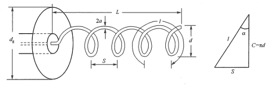
	  id:: 620dd066-8cea-44e7-a03c-4adabe32ed6d
	  **_图1：螺旋天线的几何参数_**
	-
	- 常见的同轴线尺寸有50-3，50-5，在此我们为了减小传播损耗等目的，选择50-5的同轴线，即特性阻抗为50Ω，介质直径为5mm左右，内导体直径为1.5mm左右的同轴线；考虑到阻抗匹配问题，制作轴向螺旋天线的铜丝的直径也可以选择为1.5mm。
	-
	- 氢谱线的频率是f=1420MHz，波长是λ=21cm。根据常用的设计方案，我们可以选择一个初始的方案，螺距角α=14°，d/λ=0.31，S/λ=0.25，实际上只有d，S两个变量；2a的值为1.5mm，是个固定的值；接地板的直径$d_g$我们可以选择0.75到1.5个λ，不过在此就不设定$d_g$的初值了，让系统自动设置吧。
	-
	- 写成Matlab代码则如表1所示，考虑到手测尺寸的精度，根据四舍五入的原则保留到mm级别；此外Matlab天线仿真采用的金属丝是矩形的细长条，其宽度Width和金属棒直径的换算关系为Width==3mm；螺旋的天线的长度太长并不方便，故在此选用的圈数Turns = 3。
	- ```
	  % Define Antenna
	  hx = helix('Radius',33e-3,'Width',3e-3,'Turns',3,'Spacing',53e-3)
	  fc =1.42e9;
	  minFreq = fc*0.8;
	  maxFreq = fc*1.2;
	  freqRange = linspace(minFreq,maxFreq,35);
	  % Radiation pattern
	  figure;
	  pattern(hx,fc)
	  % S11 curve
	  figure;
	  rfplot(sparameters(hx,freqRange))
	  figure;
	  show(hx)
	  ```
	  **_表1：以初始值设计螺旋天线_**
	-
	- 得到天线方向图、S11曲线如图2(a)、2(b)所示。
	-
	- 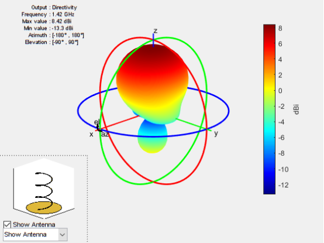
	  **_图2(a)：初始值对应的方向图_**
	-
	- 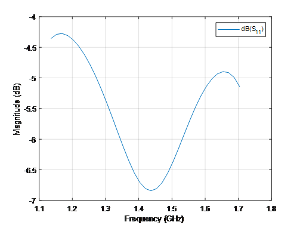{:height 385, :width 503}
	  **_图2(b)：初始值对应的S11参数_**
	-
	- 显然不是很好，我们可以进行优化，让其增益大于10dBi的同时尽可能降低在1420MHz附近的S11值。添加优化代码如表2所示，为了方便，只有变动’Radius’和’Spacing’两个变量，即对应图1中的S和d两个变量。最终得到的结果如图3(a)和图3(b)所示。
	-
	- ```% Design Varibles
	  % Property Names
	  propNames = {'Radius','Spacing'};
	  bounds = {0.03,0.05;0.05,0.073};
	  figure;
	  optAnt = optimize(hx,fc,'maximizeBandwidth', ...
	  propNames,bounds, ...
	  'Constraints',{'Gain > 10'}, ...
	  'FrequencyRange',freqRange,...
	  'UseParallel',true);
	  ```
	  **_表2：优化代码_**
	-
	- 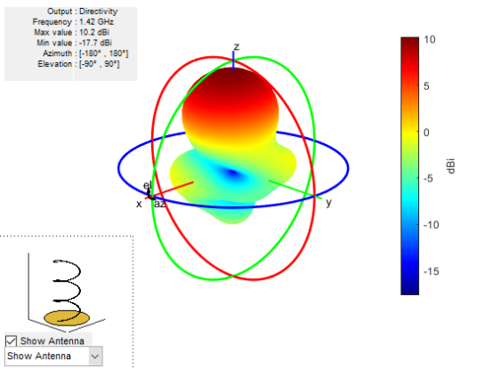{:height 423, :width 554}
	  **_图3(a)：优化后的方向图_**
	-
	- 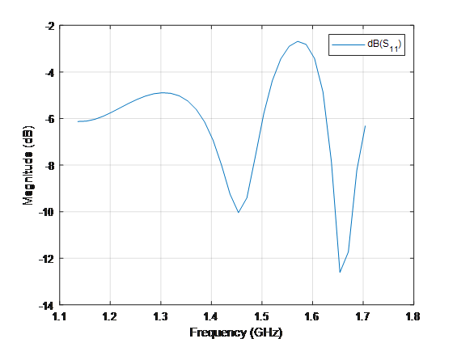
	  **_图3(b)：优化后的S11曲线_**
	-
	- 这上勉强可以接受了，我们可以在此基础上再用CST或者HFSS等软件再进行优化，使得S11参数降到更低，在此就不演示了，仍采用Matlab优化的结果进行接下来的仿真。
	  正如上文所提到的，常见雨伞的口径是105cm，最低处到口径的距离应该在20-40cm。Matlab的Antenna Designer可以仿真这样的球面，假设口径为105cm，最低处到口径的距离为15cm，把上述的天线放置在距离最低处45cm处，其代码则如表3所示，当然，表3中的代码要和表1、表2中的代码合在一起运行。
	-
	- ```
	  rs = reflectorSpherical('Radius',0.525,'Depth',0.15,'FeedOffset',[0 0 0.45],'Exciter',optAnt);
	  rs.Exciter.Tilt = 180;
	  rfplot(sparameters(rs,freqRange))
	  pattern(rs,fc)
	  ```
	  **_表3：螺旋天线放置在伞面上之后的仿真_**
	-
	- 得到的仿真结果如图4(a),4(b),4(c)所示，可以看到增益达到了20dBi，S11曲面也可以接受。当然S11曲线还是有些不足的，可以采用HFSS或者CST软件对螺旋天线进行优化，大概率是能降到比较低的，我已经做了一些优化，确实是可行的。
	-
	- 此处的球面是完整金属面的，如果采用铺有金属网格的雨伞的，实际上增益也不会下降多少，大概会下降零点几个dBi吧，基本上没影响。当然，考虑到伞的面并非理想的球面，实际上制作出来后和仿真结果比较肯定是有一些偏差的，不过至少论证了雨伞观测氢谱线理论上的可行性。
	-
	- 如果采用一些仙气飘飘的古风雨伞小型射电望远镜，或许可以让人眼前一亮，能让公众对射电天文和电子器件领域产生一些兴趣吧。
	-
	- 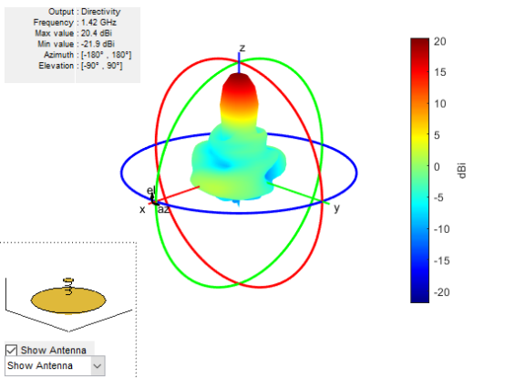
	  **_图4(a)：最终整体的方向图_**
	-
	- 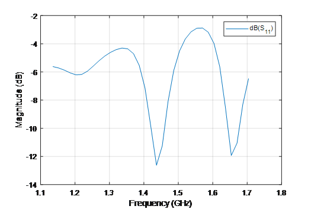
	  **_图4(b)：最终整体的S11参数_**
	-
	- 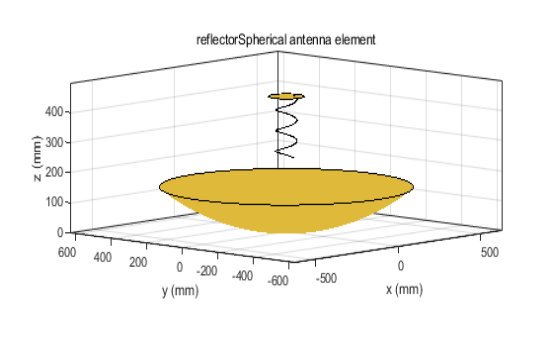
	  **_图4(c)：最终整体结构图样_**
- ## 实践
	- 下面便是螺旋天线制作成实物了，由于没有工具，便和同学随便做了一下，螺旋天线没捏好，而且底盘料不够，本来应该是圆底，于是就变成图10的样子，S参数也非常糟糕，在此就不展示了。
	-
	- 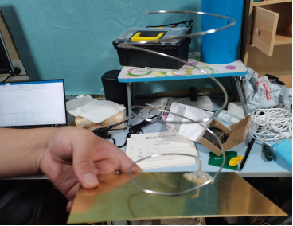
	  **_图5：糟糕的轴向螺旋天线_**
	-
	- 至此轴向螺旋天线便失败了，或者可以把易拉罐剪出薄薄的金属长条，然后直接缠绕到一个直径固定的圆筒状物体上。尽管失败，但还是可以用某些易于制作的天线来暂时代替轴向螺旋天线，以使得实践能够继续推进。做个简单的三单元直接馈电的八木天线吧，尽管这种非平衡馈电会导致波束稍微偏离中心，做出的三单元八木如图11所示。
	-
	- 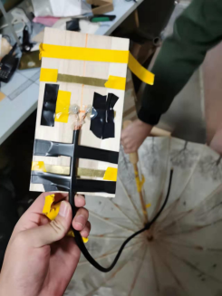
	  **_图6：直接馈电的三木天线_**
	-
	- 然后开始制作反射面，买一把好看的雨伞，然后铺上金属网格，或者直接贴铝箔也可以，过程和结果如图7所示。
	-
	- 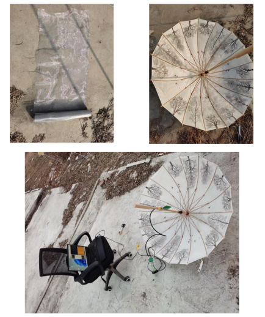
	- **_图7：铺上金属网格的雨伞_**
	-
	- 最终没用使用轴向螺旋天线，也没有使用三单元八木，而是用了一个PCB八木天线进行了代替，然后接上放大器、接收机，最终连接到电脑上。在电脑上对频谱进行积分平均后观测到的氢谱线如图8所示。
	-
	- 而此时用的低噪放大器在1420MHz有48dB的增益，远超预料的20dB增益低噪放大器。显然雨伞天线还需要很多改进。
	-
	- 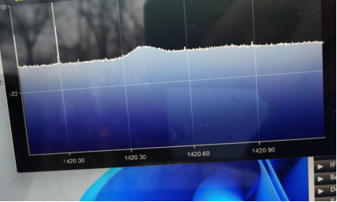
	- **_图8：观测到的氢谱线_**
-